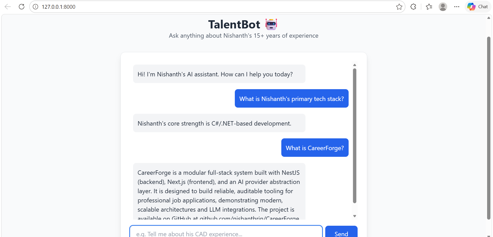

# TalentBot 🤖 | AI-Powered Professional Portfolio

**TalentBot** is a Retrieval-Augmented Generation (RAG) application that acts as an interactive AI surrogate for my professional background. Instead of reading a static PDF, recruiters and collaborators can have a real-time conversation with an AI grounded in my 15+ years of software engineering experience.

---

## 🚀 Live Demo

> 🔗 **Coming Soon** — Deployment on Render in progress.

---

## 📸 Screenshot



---

## 🛠️ Tech Stack

| Layer | Technology |
|---|---|
| LLM Orchestration | [LangChain](https://www.langchain.com/) |
| Inference Engine | [Groq LPU](https://groq.com/) — Llama 3.3-70b |
| Vector Database | [FAISS](https://github.com/facebookresearch/faiss) |
| Embeddings | HuggingFace `all-MiniLM-L6-v2` |
| Backend | [FastAPI](https://fastapi.tiangolo.com/) (Python 3.11+) |
| Frontend | HTML5 / Tailwind CSS / JavaScript |

---

## 🧠 How It Works (RAG Architecture)

```
User Question
     │
     ▼
┌─────────────────────┐
│  Embedding Model    │  ← HuggingFace all-MiniLM-L6-v2
│  (Vectorize Query)  │
└────────┬────────────┘
         │
         ▼
┌─────────────────────┐
│   FAISS Vector DB   │  ← Similarity search over resume chunks
│   (Retrieve Top-K)  │
└────────┬────────────┘
         │
         ▼
┌─────────────────────┐
│  Context Injection  │  ← Retrieved chunks → System Prompt
└────────┬────────────┘
         │
         ▼
┌─────────────────────┐
│   Groq / Llama 3    │  ← Generates grounded, factual response
│   (LLM Generation)  │
└────────┬────────────┘
         │
         ▼
    Final Answer
```

1. **Ingestion** — Resume and FAQ data are loaded and split into semantic chunks using `RecursiveCharacterTextSplitter`.
2. **Vectorization** — Chunks are converted into embeddings and stored in a local FAISS index.
3. **Retrieval** — User queries are embedded and matched against the index via cosine similarity search.
4. **Augmentation** — The most relevant chunks are injected into a carefully crafted system prompt.
5. **Generation** — Llama 3 (via Groq LPU) generates a factual, professional response grounded strictly in the retrieved context.

---

## 🏗️ Local Setup

### 1. Clone the repository

```bash
git clone https://github.com/nishanthrjn/TalentBot.git
cd TalentBot
```

### 2. Set up environment variables

Create a `.env` file in the root directory:

```env
GROQ_API_KEY=your_gsk_key_here
```

> Get your free API key at [console.groq.com](https://console.groq.com)

### 3. Install dependencies

```bash
python -m venv venv
source venv/bin/activate       # On Windows: .\venv\Scripts\activate
pip install -r requirements.txt
```

### 4. Ingest the resume data

```bash
python ingest.py
```

This reads every `.txt`/`.md` file under `data/` (recursively), chunks them, generates embeddings, and saves the FAISS index locally. Drop additional resume/notes files into `data/` and re-run this to grow the chatbot's knowledge — no code changes needed.

### 5. Run the application

```bash
python main.py
```

Visit `http://127.0.0.1:8000` in your browser.

---

## 📁 Project Structure

```
TalentBot/
├── main.py                  # FastAPI app entry point (thin, delegates to app/)
├── ingest.py                # CLI entry point for the ingestion pipeline
├── app/
│   ├── config.py             # Settings (env-driven)
│   ├── models.py              # Pydantic request/response models
│   ├── rag/                   # Embeddings, LLM client, vector store, prompt
│   ├── services/
│   │   └── chat_service.py    # Retrieval-augmented answer generation
│   ├── api/
│   │   └── routes.py          # FastAPI routes ("/", "/chat")
│   └── ingestion/
│       └── build_index.py     # Chunks every .txt/.md file under data/ → FAISS index
├── data/
│   └── *.txt, *.md          # Resume, CV, and notes — drop in more files freely
├── faiss_index/             # Generated vector index (auto-created)
├── templates/
│   └── portfolio.html       # Portfolio page (markup only)
├── static/
│   ├── css/portfolio.css     # Extracted styles
│   ├── js/
│   │   ├── data/              # content.js (profile/contact/skills), projects.js
│   │   │                      # (project catalog, per-project enabled/featured flags)
│   │   ├── modules/            # renderProfile.js, renderProjects.js, chat, modal, ...
│   │   └── main.js
│   ├── photo.jpeg
│   ├── Screenshot.png
│   └── Nishanth_Rajan_CV.pdf
├── .env                     # API keys (never committed)
├── .gitignore
├── requirements.txt
└── README.md
```

---

## 📈 Key Features

- **Contextual Accuracy** — The bot is strictly grounded in my professional history, minimising hallucinations via RAG.
- **Low Latency** — Groq's LPU hardware delivers near-instant response times even for large models.
- **Fallback Logic** — Custom professional fallback for out-of-scope queries (e.g. "I can only answer questions about Nishanth's background").
- **Recruiter-Friendly UI** — Clean chat interface with suggested starter questions.

---

## 💬 Example Questions to Ask

- *"What is Nishanth's primary tech stack?"*
- *"Tell me about the AutoPlan project."*
- *"What is CareerForge?"*
- *"Does Nishanth have experience with Docker and CI/CD?"*
- *"What is his German language level?"*
- *"Is he available to start immediately?"*

---

## 🤝 Contact

**Nishanth Rajan** — Software Engineer | EU Blue Card Holder

📍 Hannover, Germany
📧 [nishanthrajandev@gmail.com](mailto:nishanthrajandev@gmail.com)
🔗 [linkedin.com/in/nishanthrajan](https://linkedin.com/in/nishanthrajan)
🐙 [github.com/nishanthrjn](https://github.com/nishanthrjn)

---

## 📄 License

MIT License — feel free to fork and adapt for your own portfolio chatbot.